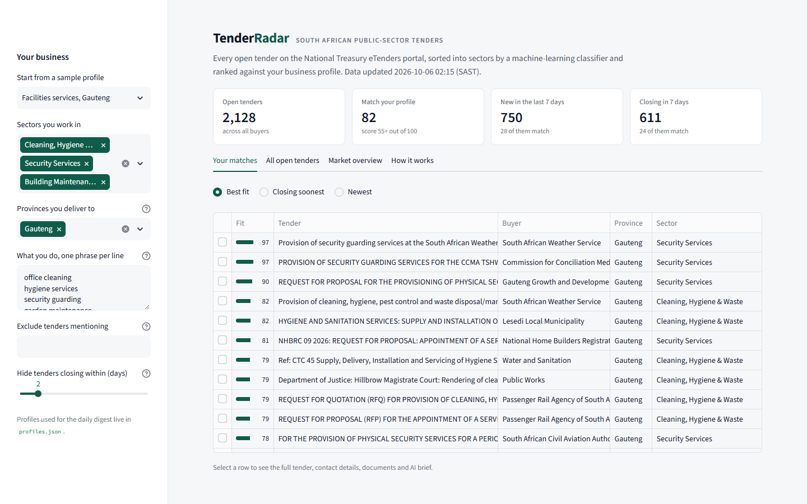

# Tender Radar

Finds South African government tenders that fit a business, and tells you about them
before they close.

Every weekday morning it collects every open tender from the National Treasury eTenders
portal, sorts them into sectors with a machine-learning classifier, ranks them against
each business profile, uses an LLM to read the tender documents of new matches, and sends
a digest by Telegram or email. Everything runs on free services.



## Why

Around 2,000 public-sector tenders are open at any time, spread across hundreds of
departments, municipalities and state-owned companies. Small suppliers miss most of the
ones they could win. The portal has no useful sector field, many tenders need a
compulsory briefing session that is easy to miss, and qualification requirements are
buried in long PDFs.

## How it works

```
eTenders portal ─▶ fetch ─▶ classify sector ─▶ score vs profiles ─▶ AI brief ─▶ Telegram / email
  (daily, free)              (scikit-learn)      (TF-IDF + rules)     (Gemini/Groq       │
                                                                       free tier)        ▼
                                          data/*.csv.gz committed by GitHub Actions ─▶ Streamlit app
```

1. **Collect.** `radar/etenders.py` reads the JSON feed behind the eTenders tender list,
   which includes province, contact and briefing details that the official OCDS API
   leaves out. Closed tenders stay in the archive for six months.
2. **Classify.** The buyer-chosen category is unreliable, so sectors are assigned by
   weak supervision (`radar/classify.py`):
   - Keyword rules label tenders whose description clearly names the work (about 48%).
   - A TF-IDF + logistic regression model, trained on those labels (10,876 examples from
     23,344 current and cancelled listings), labels the rest. Rule keywords are masked
     during training, so the model learns from context rather than re-learning the rules.
     The tenders it is used on contain none of those keywords.
   - **5-fold cross-validation: 71% accuracy, macro F1 0.71 across 15 sectors.** Tenders
     the model is unsure about (below 40% confidence) are left as "Other".
3. **Match.** `radar/match.py` scores each tender from 0 to 100 against a profile:
   40% sector, 30% phrase similarity (TF-IDF cosine), 30% province.
4. **Brief.** For new matches, `radar/brief.py` downloads the tender PDF and asks a
   free-tier LLM to extract the scope, CIDB grading, preference points, qualification
   requirements and anything that could disqualify a bidder. Output is validated and
   cached, so each tender is only sent once.
5. **Notify.** `radar/notify.py` sends new matches and tenders closing within three
   days.
6. **Explore.** `app.py` is a Streamlit dashboard where you can build a profile, browse
   and search tenders, open a tender's details and documents, see similar tenders, and
   view market charts.

## Free stack

| Part | Service |
|------|---------|
| Data | eTenders public portal (no key) |
| Scheduling and storage | GitHub Actions + data committed to the repo |
| ML | scikit-learn |
| LLM | Google Gemini or Groq free tier, optional |
| Alerts | Telegram bot API or Gmail SMTP |
| Dashboard | Streamlit Community Cloud |

## Setup

```bash
python -m venv .venv
.venv\Scripts\activate          # macOS/Linux: source .venv/bin/activate
pip install -r requirements.txt
python -m scripts.build_corpus   # one-off: classifier training text (~1 minute)
python -m scripts.run_daily --no-notify
streamlit run app.py
```

Tests: `pip install pytest && pytest`

### Turning on the automation

The workflow in `.github/workflows/daily.yml` runs at 06:00 SAST on weekdays. Add any of
these as repository secrets (Settings → Secrets and variables → Actions); each feature
switches on when its secrets are present.

| Secret | Used for |
|--------|----------|
| `GEMINI_API_KEY` or `GROQ_API_KEY` | AI briefs ([Google AI Studio](https://aistudio.google.com/apikey), [Groq](https://console.groq.com/keys)) |
| `TELEGRAM_BOT_TOKEN`, `TELEGRAM_CHAT_ID` | Telegram digest (create a bot with @BotFather) |
| `SMTP_USER`, `SMTP_PASSWORD`, `DIGEST_EMAIL` | Email digest (a Gmail app password works) |

Profiles for the digest are in `profiles.json`. The same API keys can be added as
Streamlit secrets to generate briefs on demand in the app.

## Project layout

```
app.py                     Streamlit dashboard
radar/etenders.py          eTenders client
radar/taxonomy.py          Sector keyword rules
radar/classify.py          Weakly supervised sector classifier
radar/match.py             Profile scoring
radar/brief.py             LLM tender briefs
radar/notify.py            Telegram and email digests
radar/pipeline.py          The daily run
scripts/                   Command-line entry points
data/                      Tender archive, training corpus, briefs, run status
tests/                     Unit tests
```

## Limitations

- The classifier is trained on rule-generated labels, so its score measures agreement
  with the rules on held-out tenders, not with a hand-labelled set.
- Scanned tender PDFs have no extractable text; briefs for those use the listing only.
- Free LLM tiers have daily limits, so briefs are capped at 15 a day.
- Not affiliated with National Treasury. Always read the official tender document.

## Author

Tshilidzi Mugeri · [GitHub](https://github.com/tshilidzimugeri-rgb)
